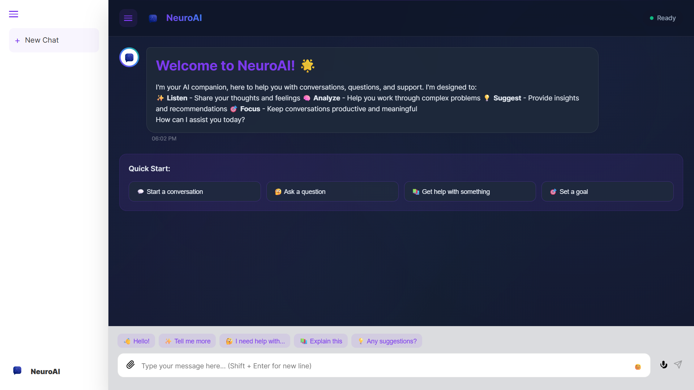

<div align="center"></div>

# <div align="center">NeuroAI</div>

## A modern and intuitive React+Vite based chatbot

NeuroAI is a web-based chatbot designed to provide a seamless and interactive conversational experience. Built with React and Vite, it integrates Gemini API to offer real-time responses, smart suggestions, and efficient chat management. Its sleek, animated interface ensures a delightful user experience across various devices.

## ✨ Features

  * **Intelligent AI Assistant**: Powered by a Google Gemini for dynamic and responsive conversations.
  * **Conversational Management**:
      * **New Chat Sessions**: Easily initiate new conversations.
      * **Session Persistence**: Chat sessions are saved and loaded from local storage, allowing users to resume previous conversations.
      * **Session Deletion**: Users can delete past chat sessions.
  * **Rich Input Controls**:
      * **Quick Replies**: Pre-defined suggestions for common phrases to speed up interactions.
      * **Emoji Picker**: Conveniently add emojis to messages.
      * **Voice Input (Placeholder)**: Structure for future voice messaging functionality.
      * **File Attachment (Placeholder)**: Structure for future file sharing capabilities.
  * **Interactive Messaging**:
      * **Markdown Support**: Messages are rendered with Markdown for rich text formatting.
      * **Message Reactions**: Users can react to messages with emojis (👍, ❤️, 😊, 🤔, 👎).
      * **Copy to Clipboard**: Easily copy message content.
  * **Responsive and Animated UI**:
      * Smooth animations and transitions for a fluid user experience.
      * Dynamic background gradients and particle effects.
      * Optimised for various screen sizes, ensuring a seamless experience on desktops and mobile devices.
      * Collapsible sidebar navigation for a cleaner interface.
  * **Theming**: Includes a `ThemeProvider` for potential future theme customisation.

## 🚀 Live Demo

Experience NeuroAI live here: [**NeuroAI**](https://www.google.com/search?q=https://TheNeuroAI.vercel.app)

 <div align="center">
 <p>

[](https://github.com/ellerbrock/open-source-badges/)


 </p>
 </div>

## 📸 Screenshots

<div align="center"></div>
<div align="center"></div>

## 📺 Video Explanation

For a detailed walkthrough of NeuroAI's features and how to use them, check out this video:

**[Insert YouTube Video Link Here]**

## 🛠️ Technologies Used

  * **React**: A JavaScript library for building user interfaces.
  * **Vite**: A fast build tool for modern web projects.
  * **Google Gemini**: For intelligent conversational responses.
  * **react-markdown**: For rendering Markdown content.
  * **react-textarea-autosize**: For auto-resizing text input fields.
  * **CSS Modules**: For scoped component-level styling.

## ⚙️ Installation and Setup

To get NeuroAI up and running on your local machine, follow these steps:

1.  **Clone the repository:**

    ```bash
    git clone https://github.com/eccentriccoder01/NeuroAI.git
    cd NeuroAI
    ```

2.  **Install dependencies:**

    ```bash
    npm install
    # or
    yarn install
    ```

3.  **Set up environment variables:**
    Create a `.env` file in the root directory and add your Google AI API key:

    ```
    VITE_GOOGLE_AI_API_KEY=YOUR_API_KEY_HERE
    ```

4.  **Run the application:**

    ```bash
    npm run dev
    # or
    yarn dev
    ```

    This will start the development server, usually at `http://localhost:5173`.

## Issue Creation ✴
Report bugs and  issues or propose improvements through our GitHub repository.

## Contribution Guidelines 📑

- Firstly Star(⭐) the Repository
- Fork the Repository and create a new branch for any updates/changes/issue you are working on.
- Start Coding and do changes.
- Commit your changes
- Create a Pull Request which will be reviewed and suggestions would be added to improve it.
- Add Screenshots and updated website links to help us understand what changes is all about.

- Check the [CONTRIBUTING.md](CONTRIBUTING.md) for detailed steps...

    
## Contributing is fun🧡

Enhance NeuroAI with your contributions! Whether you have innovative suggestions, spot bugs, or wish to introduce new features.
Contributions of any kind from anyone are always welcome🌟❕

Your insights are invaluable to us. Reach out to us team for any inquiries, feedback, or concerns.

## 📄 License

This project is open-source and available under the MIT License.

## 📞 Contact

Developed by [Eccentric Explorer](https://eccentriccoder01.github.io/Me)

Feel free to reach out with any questions or feedback\!